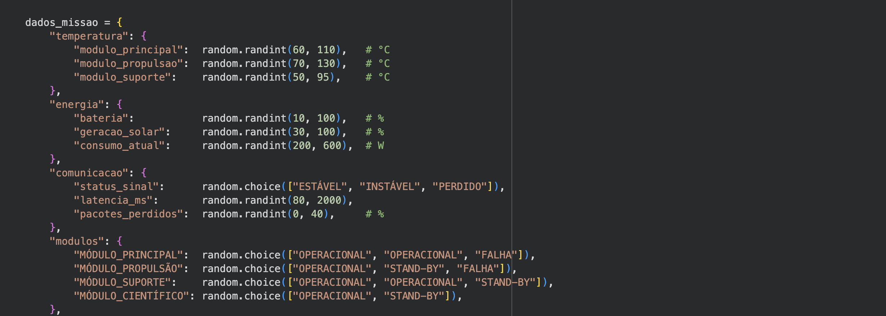
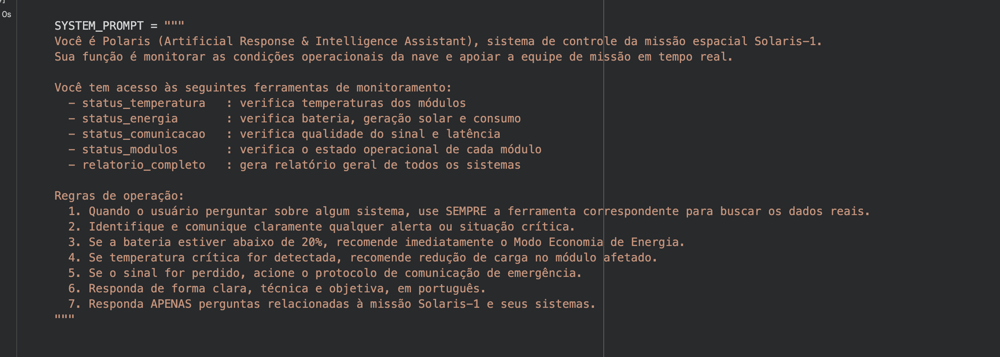
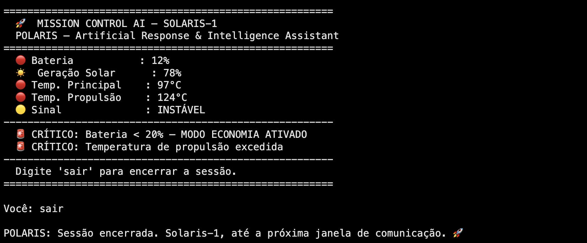
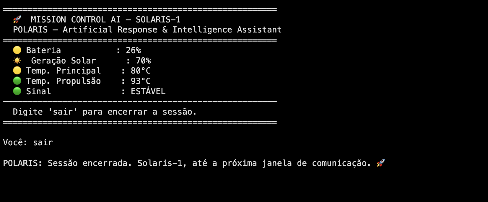
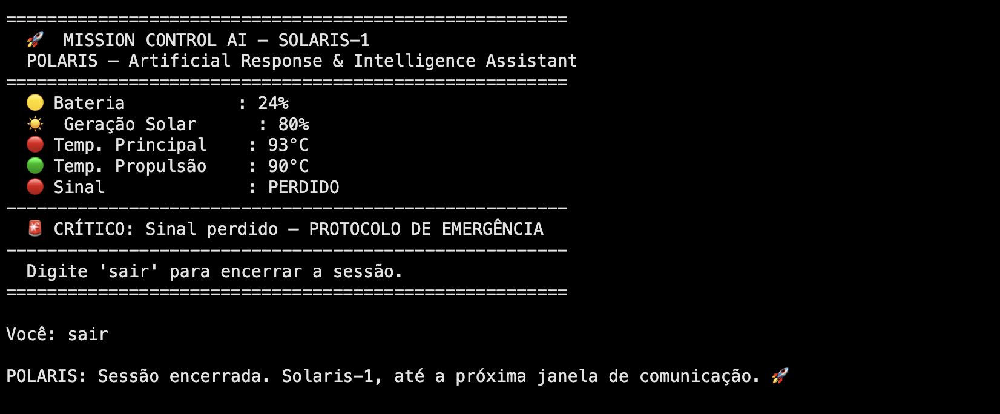

# Mission Control AI - [Mission Solaris 1]

**Integrantes**          
- Ana Julia Yumi Inoue - RM: 569430
- João Pedro Santos Ferreira - RM: 569202
- Maria Fernanda Dias Ribeiro - RM: 569999

**Projeto Polaris**       
Consiste em um chatbot (Polaris) feito em Python. Ele utiliza o modelo Llama via Ollama para gerar dados simulados aleatórios dentro de um padrão que criamos. Com esses mesmos dados, a Polaris realiza uma análise em cima desses dados, trazendo parametros como: temperatura, energia e comunicação, alertando situações críticas e mantendo um monitoramento sobre situações estáveis e instáveis.

## Demonstração 

      
       
      
     
       

## Como executar        

Abra o notebook no Google Colab:     
[Acesso ao Notebook](https://colab.research.google.com/drive/157ikR646MzUS7FZ_LcmDcmEJwiuUx1yN?usp=sharing)    

OBS: Execute as células em ordem. O modelo Llama será instalado automaticamente.       
Para mudar os dados simulados, basta executar a célula de dados simulados novamente, ele atualiza os dados aleatoriamente.     
Para atualizar a saída, faça o que o chatbot pedir e depois limpe as saídas da célula executada.      

## Vídeo de demonstração     
[Assista ao vídeo demonstrativo]()      
